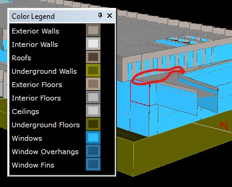

# Boundary Conditions:
## BC's are assigned in *.inp file in block
```f#
    $ *********************************************************
    $ **                                                     **
    $ **      Floors / Spaces / Walls / Windows / Doors      **
    $ **                                                     **
    $ *********************************************************
```
-  Using Privately shared model as reference:<br>
  **Underground Wall**
    ```f#
        "Mechanical-2_L-1_SP" = SPACE           
            SHAPE            = POLYGON
            POLYGON          = "Mechanical-2_L-1 Plg"
            C-ACTIVITY-DESC  = *mech*
            ..
         "Mechanical-2_L-1_SOG" = UNDERGROUND-WALL
            LOCATION         = BOTTOM
            ..
         "Underground Wall 35" = UNDERGROUND-WALL
            HEIGHT           = 22
            LOCATION         = SPACE-V1
            ..
         "Underground Wall 36" = UNDERGROUND-WALL
            HEIGHT           = 22
            LOCATION         = SPACE-V2
            ..
         "Underground Wall 37" = UNDERGROUND-WALL
            HEIGHT           = 22
            LOCATION         = SPACE-V3
            ..
    ```
-  **Underground Roof/Ceiling**
    ```f#
        "Animal Holding-2_L-1_SP" = SPACE           
            SHAPE            = POLYGON
            POLYGON          = "Animal Holding-2_L-1 Plg"
            C-ACTIVITY-DESC  = *hold*
            ..
         "Animal Holding-2_L-1_SOG" = UNDERGROUND-WALL
            LOCATION         = BOTTOM
            ..
    ```
-  **Above Ground walls / Ceiling adjacent to off-set inboard; higher story**
    ```f#
        "Corridor-3_L2_SP" = SPACE           
            SHAPE            = POLYGON
            SOURCE-SCHEDULE  = {#L("PEOPLE-SCHEDULE")}
            SOURCE-TYPE      = PROCESS
            SOURCE-POWER     = {#L("AREA")/#L("AREA/PERSON")*(450-350)}
            NUMBER-OF-PEOPLE = 0
            POLYGON          = "Corridor-3_L2 Plg"
            C-ACTIVITY-DESC  = *corr*
            ..
        "Corridor-3_L2_IW" = INTERIOR-WALL   
            NEXT-TO          = "Corridor-3_L2_Dmy_SP"
            CONSTRUCTION     = "Default Air Wall Construction"
            LOCATION         = TOP
            ..
        "Corridor-3_L2_Dmy_SP" = SPACE           
            SHAPE            = POLYGON
            AIR-CHANGES/HR   = 0
            PEOPLE-HG-LAT    = 177
            PEOPLE-HG-SENS   = {268-#pa("Btu_per_person")}
            PEOPLE-HEAT-GAIN = {450-#pa("Btu_per_person")}
            LIGHTING-W/AREA  = ( 0 )
            EQUIPMENT-W/AREA = ( 0 )
            POLYGON          = "Corridor-3_L2 Plg"
            C-ACTIVITY-DESC  = *corr*
            ..
    ```

<br>
-  ## But thats odd

    ```f#
        "Lobby-1_L1_SP" = SPACE           
            SHAPE            = POLYGON
            SOURCE-SCHEDULE  = {#L("PEOPLE-SCHEDULE")}
            SOURCE-TYPE      = PROCESS
            SOURCE-POWER     = {#L("AREA")/#L("AREA/PERSON")*(450-350)}
            INF-FLOW/AREA    = {5000/#p("AREA") $ 5,000 cfm infiltration}
            NUMBER-OF-PEOPLE = 0
            POLYGON          = "Lobby-1_L1 Plg"
            C-ACTIVITY-DESC  = *lobb*
            ..
         "Lobby-1_L1_EW1" = EXTERIOR-WALL   
            HEIGHT           = 35.5
            LOCATION         = SPACE-V1
            ..
         "Window 153" = WINDOW          
            HEIGHT           = {34.5*#pa("WWR_adj")}
            ..
         "Exterior Wall 265" = EXTERIOR-WALL   
            Z                = 20
            HEIGHT           = 15.5
            WIDTH            = 15.6
            AZIMUTH          = 180
            LOCATION         = SPACE-V2
            ..
         "Window 155" = WINDOW          
            HEIGHT           = {14.5*#pa("WWR_adj")}
            ..
         "Exterior Wall 309" = EXTERIOR-WALL   
            X                = 280.7
            Z                = 20
            HEIGHT           = 15.5
            WIDTH            = 6
            AZIMUTH          = 90
            LOCATION         = SPACE-V2
            ..
         "Window 158" = WINDOW          
            HEIGHT           = {14.5*#pa("WWR_adj")}
            ..
         "Lobby-1_L1_IW" = INTERIOR-WALL   
            NEXT-TO          = "Lobby-1_L1_Dmy_SP"
            CONSTRUCTION     = "Default Air Wall Construction"
            LOCATION         = TOP
            ..
         "Lobby-1_L1_Dmy_SP" = SPACE           
            SHAPE            = POLYGON
            AIR-CHANGES/HR   = 0
            PEOPLE-HG-LAT    = 177
            PEOPLE-HG-SENS   = {268-#pa("Btu_per_person")}
            PEOPLE-HEAT-GAIN = {450-#pa("Btu_per_person")}
            LIGHTING-W/AREA  = ( 0 )
            EQUIPMENT-W/AREA = ( 0 )
            POLYGON          = "Lobby-1_L1 Plg"
            C-ACTIVITY-DESC  = *lobb*
            ..
   ```

<br>

-  ## Std Outdoor Wall/Roof-ceiling

    ```f#
        "Electrical-1_L4_SP" = SPACE           
            SHAPE            = POLYGON
            POLYGON          = "Electrical-1_L4 Plg"
            C-ACTIVITY-DESC  = *elec*
            ..
         "Electrical-1_L4_EW1" = EXTERIOR-WALL   
            LOCATION         = SPACE-V1
            ..
         "Electrical-1_L4_EW2" = EXTERIOR-WALL   
            LOCATION         = SPACE-V2
            ..
         "Exterior Wall 136" = EXTERIOR-WALL   
            LOCATION         = SPACE-V3
            ..
         "Exterior Wall 137" = EXTERIOR-WALL   
            LOCATION         = SPACE-V4
            ..
         "Exterior Wall 138" = EXTERIOR-WALL   
            LOCATION         = SPACE-V5
            ..
         "Exterior Wall 139" = EXTERIOR-WALL   
            LOCATION         = SPACE-V6
            ..
    ```
